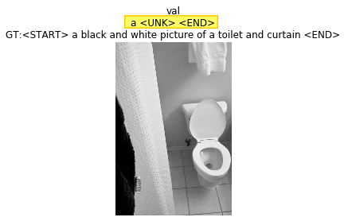

### Итоги дня (CS231n)
* Сделал задание 3.2 (Image Captioning with LSTMs)

Прогноз переобученной модели на одном из примеров валидации:

Код CS231n в [репозитории](https://github.com/ningeen/stanford_cs231n).